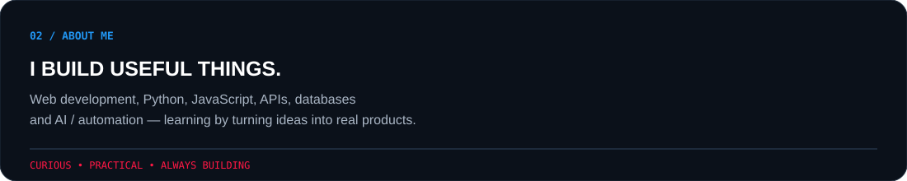
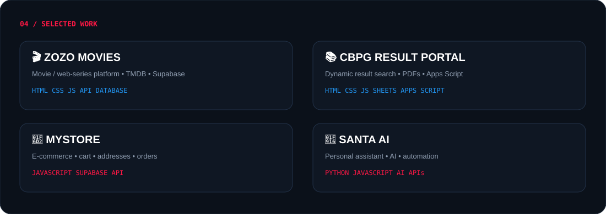

 

 

---

---

# 03 / WHAT I DO

<table>
<tr>
<td width="33%" align="center"> <h2>01</h2><h3>WEB</h3><code>HTML</code> <code>CSS</code> <code>JS</code>  Modern UI Responsive apps Frontend systems  </td>
<td width="33%" align="center"> <h2>02</h2><h3>BACKEND</h3><code>PYTHON</code> <code>API</code> <code>SUPABASE</code>  Data systems APIs Automation  </td>
<td width="33%" align="center"> <h2>03</h2><h3>AI / AUTOMATION</h3><code>AI</code> <code>PYTHON</code>  Personal assistants Smart workflows Experiments  </td>
</tr>
</table>

---

---

# 05 / TECH STACK

  

<code>HTML</code> <code>CSS</code> <code>JavaScript</code> <code>Python</code>
<code>React</code> <code>Supabase</code> <code>Git</code> <code>GitHub</code>
<code>VS Code</code> <code>Vercel</code>

---

# 06 / GITHUB ANALYTICS

  

---

# 07 / CONTRIBUTION ACTIVITY

---

# 08 / CURRENTLY LEARNING

<table>
<tr>
<td align="center">JAVASCRIPT <b>██████████████░░</b></td>
<td align="center">PYTHON <b>████████████░░░░</b></td>
<td align="center">REACT <b>██████████░░░░░░</b></td>
<td align="center">AI <b>█████████░░░░░░░</b></td>
</tr>
</table>

---

# 09 / PHILOSOPHY

## **TOOLS CHANGE.**
## **CURIOSITY DOESN'T.**

`CODE` → `CREATE` → `LEARN` → `IMPROVE`

---

# 10 / CONNECT

  

  

### `SURAJ PRAJAPATI`
BUILDING IDEAS INTO REAL PROJECTS.

