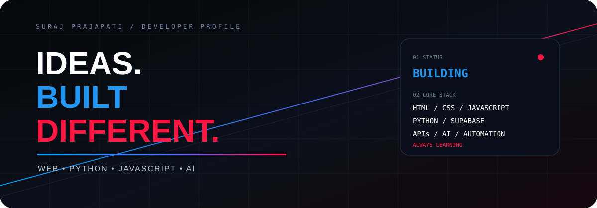
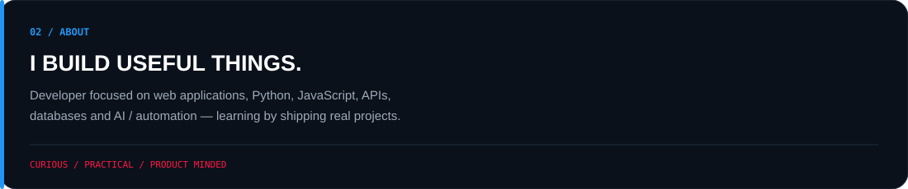
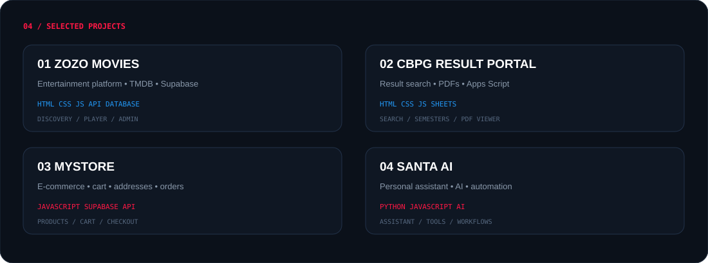

 

 

---

---

# 03 / EXPERTISE

<table><tr>
<td width="33%" align="center"><h1>01</h1><h3>WEB ENGINEERING</h3><code>HTML</code> <code>CSS</code> <code>JS</code>  Interfaces Responsive Apps Frontend Systems</td>
<td width="33%" align="center"><h1>02</h1><h3>BACKEND & DATA</h3><code>PYTHON</code> <code>API</code> <code>SUPABASE</code>  APIs Databases Automation</td>
<td width="33%" align="center"><h1>03</h1><h3>AI & AUTOMATION</h3><code>AI</code> <code>PYTHON</code>  Assistants Smart Workflows Experiments</td>
</tr></table>

---

---

# 05 / TECHNOLOGY

  
<code>HTML</code> · <code>CSS</code> · <code>JavaScript</code> · <code>Python</code> · <code>React</code> · <code>Supabase</code> · <code>Git</code> · <code>GitHub</code> · <code>VS Code</code> · <code>Vercel</code>

---

# 06 / GITHUB STATS

  

> **Note:** The contribution graph is intentionally not embedded here because third-party activity-graph endpoints can randomly fail and leave the large broken-image box you saw. GitHub already shows the real contribution graph directly on your profile.

---

# 07 / CURRENTLY BUILDING

<table>
<tr><td><b>JavaScript</b> <code>██████████████░░</code></td><td><b>Python</b> <code>████████████░░░░</code></td><td><b>React</b> <code>██████████░░░░░░</code></td><td><b>AI / Automation</b> <code>█████████░░░░░░░</code></td></tr>
</table>

---

# 08 / PHILOSOPHY

## TOOLS CHANGE.
## CURIOSITY DOESN'T.

`CODE` → `CREATE` → `LEARN` → `IMPROVE`

---

# 09 / CONNECT

  

  
<b>SURAJ PRAJAPATI</b> 
BUILDING IDEAS INTO REAL PROJECTS.

