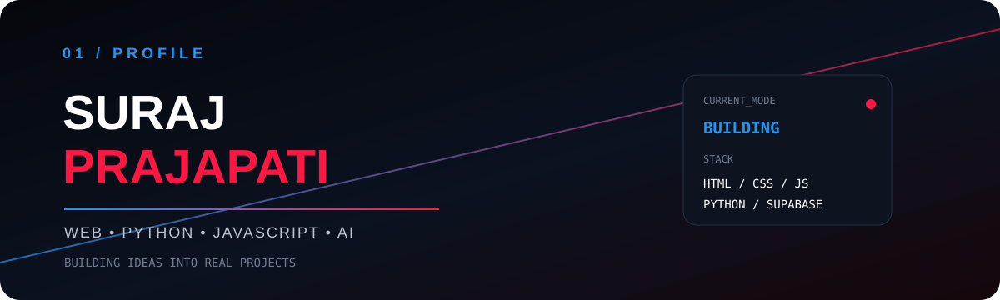

<div align="center">

</div>

<div align="center">
<a href="https://github.com/zozomovie"></a>
<a href="https://github.com/zozomovie?tab=repositories"></a>
<a href="mailto:YOUR_EMAIL@gmail.com"></a>
</div>

## <span style="color:#2196F3">02 / ABOUT ME</span>

> **I build useful things, learn by building, and turn ideas into working products.**

I'm **Suraj Prajapati**, focused on modern web development, JavaScript, Python, APIs, databases and AI/automation.

```text
FOCUS
├── Web Development
├── JavaScript & Python
├── Backend & APIs
├── Supabase / Databases
└── AI & Automation
```

---

## <span style="color:#ff1744">03 / WHAT I DO</span>

<table><tr>
<td width="33%" align="center"><h3>🌐 WEB</h3><b>HTML • CSS • JavaScript</b><br><br>Responsive interfaces<br>Modern UI<br>Web applications</td>
<td width="33%" align="center"><h3>⚙️ BACKEND</h3><b>Python • APIs • Supabase</b><br><br>Data systems<br>Authentication<br>Automation</td>
<td width="33%" align="center"><h3>🤖 AI / AUTOMATION</h3><b>AI • APIs • Tools</b><br><br>Personal assistants<br>Smart workflows<br>Experiments</td>
</tr></table>

---

## <span style="color:#2196F3">04 / FEATURED WORK</span>

<table>
<tr>
<td width="50%"><h3>🎬 ZOZO MOVIES</h3>Entertainment platform with movie/web-series discovery, TMDB integration, search, admin tools and custom player experience.<br><br><b>Stack:</b> <code>HTML</code> <code>CSS</code> <code>JavaScript</code> <code>TMDB</code> <code>Supabase</code></td>
<td width="50%"><h3>📚 CBPG RESULT PORTAL</h3>Online result-search system with roll-number search, dynamic semesters, PDF viewing and Google Apps Script integration.<br><br><b>Stack:</b> <code>HTML</code> <code>CSS</code> <code>JavaScript</code> <code>Apps Script</code></td>
</tr>
<tr>
<td width="50%"><h3>🛒 MYSTORE</h3>E-commerce project with products, cart, saved addresses, location support and order workflow.<br><br><b>Stack:</b> <code>HTML</code> <code>CSS</code> <code>JavaScript</code> <code>Supabase</code></td>
<td width="50%"><h3>🤖 SANTA AI</h3>Personal AI assistant project focused on natural interaction, APIs, automation and useful desktop workflows.<br><br><b>Stack:</b> <code>Python</code> <code>JavaScript</code> <code>AI</code> <code>APIs</code></td>
</tr>
</table>

---

## <span style="color:#ff1744">05 / TECH STACK</span>
<div align="center">

</div>

---

## <span style="color:#2196F3">06 / GITHUB ANALYTICS</span>
<div align="center">


<br><br>

</div>

---

## <span style="color:#ff1744">07 / CONTRIBUTIONS</span>
<div align="center">

</div>

---

## <span style="color:#2196F3">08 / CURRENTLY LEARNING</span>
```text
JavaScript       ███████████████░░░░░
Python           █████████████░░░░░░░
React            ██████████░░░░░░░░░░
Backend          ██████████░░░░░░░░░░
AI / Automation  █████████░░░░░░░░░░░
```

---

## <span style="color:#ff1744">09 / PHILOSOPHY</span>
<div align="center">

# TOOLS CHANGE.
# CURIOSITY DOESN'T.

**CODE → CREATE → LEARN → IMPROVE**

</div>

---

## <span style="color:#2196F3">10 / CONNECT</span>
<div align="center">
<a href="https://github.com/zozomovie"></a>
<a href="mailto:YOUR_EMAIL@gmail.com"></a>
<br><br>

<br><br>
### `SURAJ PRAJAPATI`
<sub>BUILDING IDEAS INTO REAL PROJECTS.</sub>
</div>
